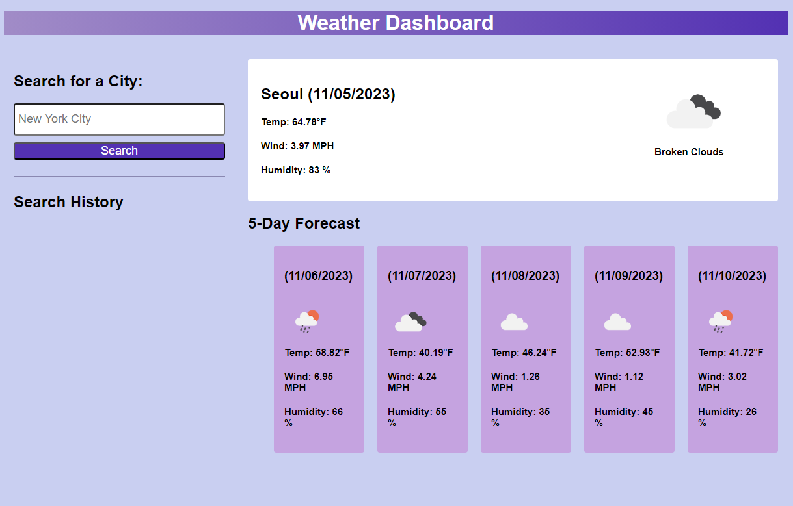

# weather-dashboard

## Description

The purpose of this application is to allow users to view the current and forcasted weather of any location so that they may plan trips accoringly 

## Usage

To use this application, users can navigate to the search bar on the left side of the page and input a location of their choice that they wish to view the weather forecast of. After clicking *Search*, the current weather will appear on the right side along with a 5 day forecast underneith. 

### Link

[Link to deployed application](https://camparooni.github.io/weather-dashboard/)

## Credits

This application was made using the [Open Weather API](https://openweathermap.org/api)!

## Badges

